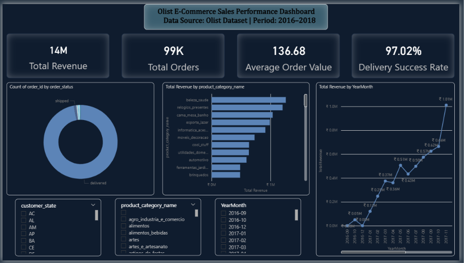
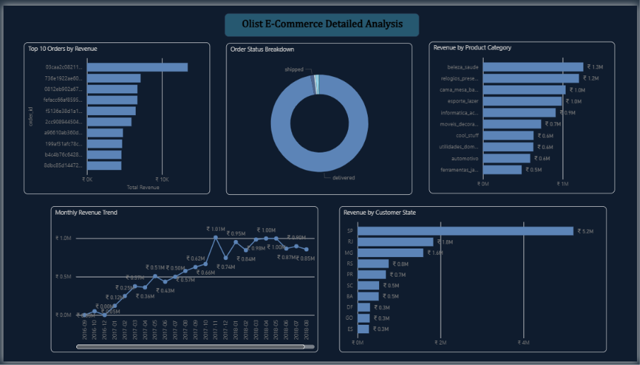

# E-Commerce Sales Analysis — Olist Brazilian Marketplace

## Project Overview

This project is an end-to-end data analysis of the Olist Brazilian E-Commerce Dataset using MySQL and Power BI. The objective was to analyze sales performance, customer behavior, product category trends, order fulfillment efficiency, and geographic revenue distribution to generate actionable business insights.

## Tools & Technologies

* MySQL 8.0
* SQL
* Power BI
* DAX Measures
* GitHub

## Dataset

* Dataset: Olist Brazilian E-Commerce Public Dataset
* Source: Kaggle
* Period: 2016–2018
* Records: 100,000+ Orders

## Dashboard Preview

### Executive Dashboard

### Detailed Analysis

## Key Business Insights

* Top product categories contribute the majority of platform revenue.
* Revenue shows strong seasonal growth patterns.
* São Paulo generates the highest revenue among all states.
* Delivery success rate exceeds 97%.
* Monthly revenue demonstrates consistent growth.
* Revenue concentration varies significantly by region.
* Average Order Value helps identify high-value customer segments.

## What This Project Demonstrates

* SQL data analysis
* Data modeling
* Business insight generation
* Dashboard development in Power BI
* KPI creation using DAX
* End-to-end Data Analyst workflow
